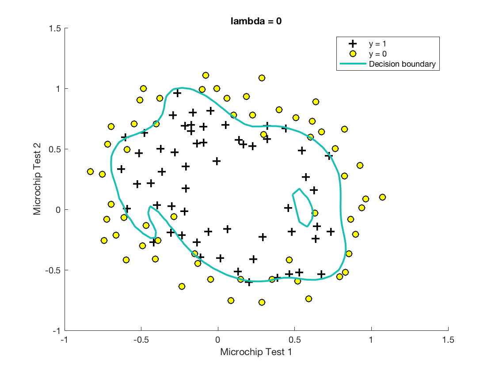
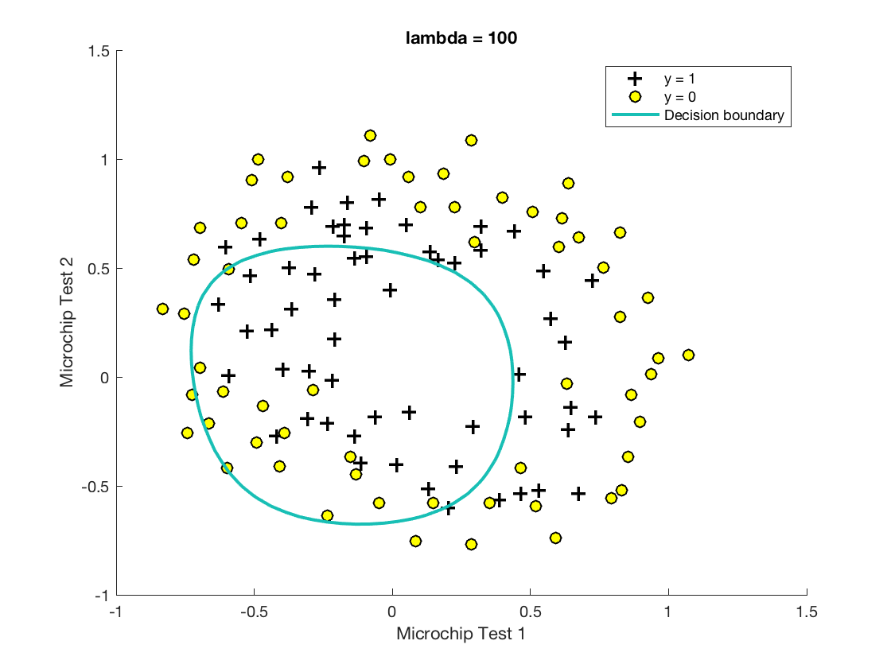
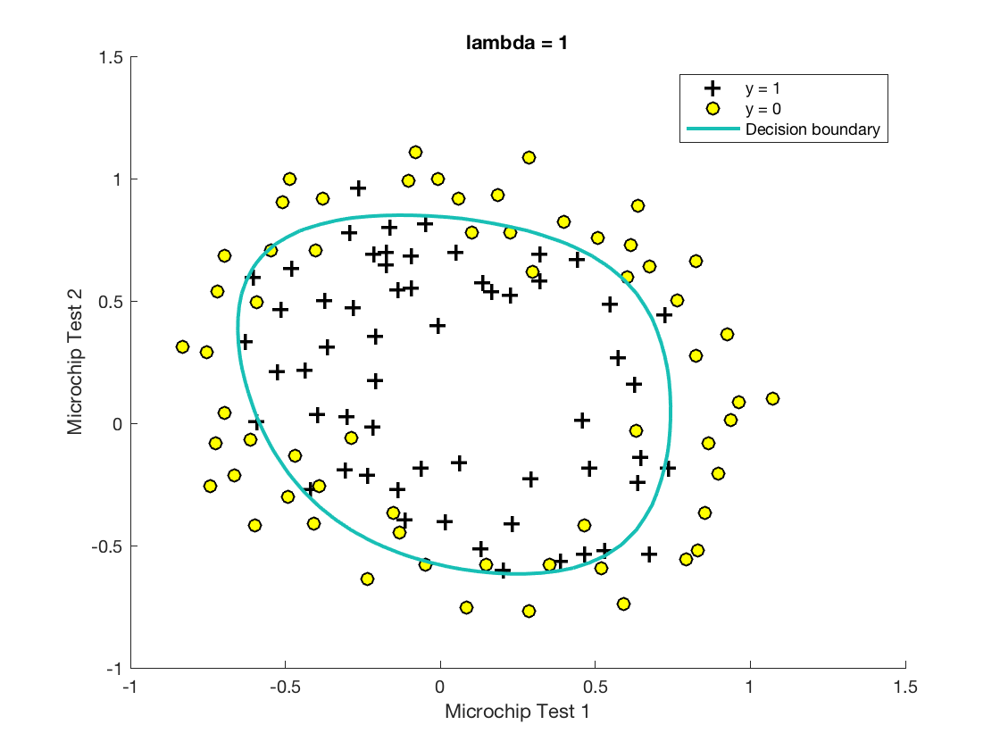

# Regularization
With different regularization parameters, we could see how regularization affects the decision boundary.

Without regularization, the overfitting decision boundary is not good for unseen data.

With a large regularization parameter, the underfitting decision boundary is not accurate for the training data.

With a suitable regularization parameter, we got a good decision boundary.

